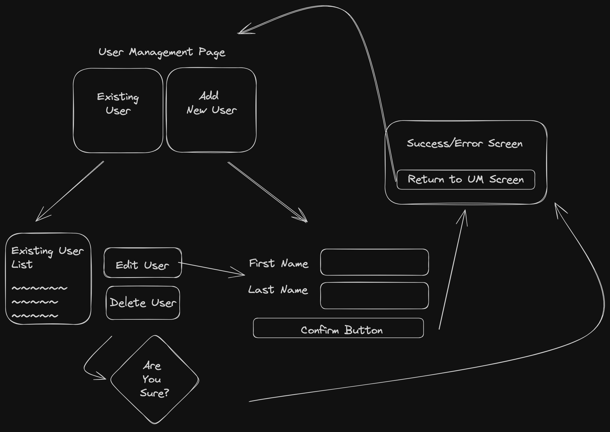
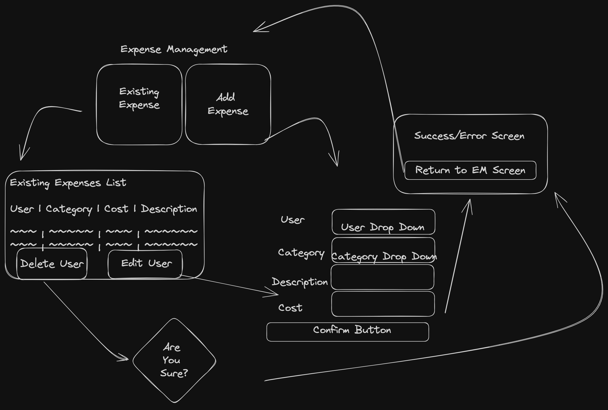

# Expense Management Application

This project provides an expense management application that allows users to create, edit, and delete both users and expenses. The application uses a series of indexedDB stores to reliably save user and expense data. These stores are linked by matching keys, enabling efficient CRUD operations.

## Data Structures and Algorithms

To ensure scalability and support CRUD operations effectively, the application utilizes the following data structure:

- **Expense Data:** Each expense has a:
    - expense_id (unique_id)
    - category_id (mapping to category_table)
    - user_id (mapping to user_table)
    - expense_description
    - expense_cost
- **User Data:** Each user has a:
    - user_id (unique_id)
    - user_first_name
    - user_last_name
- **Category Data:** Each category has a:
    - category_id (unique_id)
    - category_name

I decided to use UUIDs as unique keys for users and expenses, as using datetime as a unique key could have led to conflicts when multiple users and expenses Ire added. This approach ensures that each user and expense has a unique identifier, allowing for scalable CRUD operations that meet the project objectives.

### Considerations

During the implementation, I carefully considered the performance implications and trade-offs. Although the application is designed for efficient CRUD operations, it is important to note potential limitations and constraints, particularly concerning scalability and performance with a growing user base and increasing expense data.

## Application Setup

To set up and run the application, follow these steps:

1. Clone the repository to your local machine.
2. Install the necessary dependencies using `npm install`.
3. Run the application using `npm start`.

## Design

**User Management**

**Expense Management**

## Things To Add in Future
    - Currently code assumes only one page of browser is open at a time.
    - Supply more comprehensive visualiztions on the summary page
        - Users Ranked by their expenses
        - Add some sort of date value to expenses to track expenses over time
        - Clearer differentiation between users with same name
